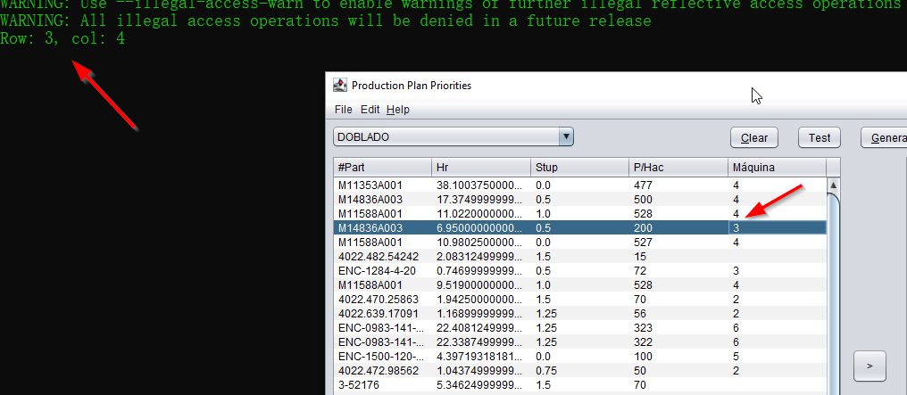

# 1) Updating the table ...



La tabla es llenada por medio del Dropdown ... Miriam podría editarla en cualquier momento.
Por medio del *listener* es posible obtener el valor de la tabla ...

Lo que se tiene que hacer es modificar el valor original en la lista original.

## Idea 1)

```java
var xs = listaOriginal.
    stream()
    .filter(item -> item.getWorkCenter().equalsIgnoreCase(dropDownValue))
    .collect(toList());

final int row = evt.getRow();
final int col = evt.getColumn();

var val = table.getValueAt(row, col);

xs.get(row).setXXX(val);
```

### Consideraciones para #1

Lo que obtenemos por medio de Swing siempre será un Object ..., tendremos que convertirlo a String.

¿Qué pasa si Miriam quiere editar algún otro valor (columna)?

Aquí podemos restringirlo ... (ver la siguiente sección ... )

### Restricciones ...
- Que solo se pueda editar la columna #4.

### Consideraciones para #2

Dentro de la clase **WorkOrderInformation** no existe una propiedad para *machine*.

Puede ser resuelto fácilmente con un:

```java
private String machine = "";
```
y:
```java
public Builder machine(final String machine) {
    this.machine = machine;
    return this;
}
```
