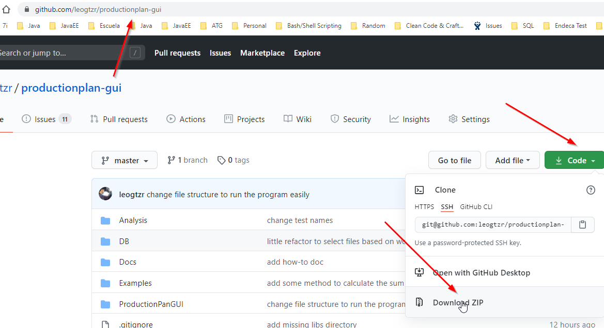
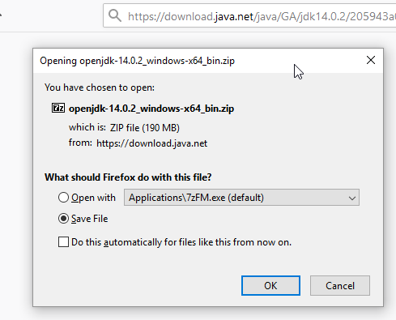
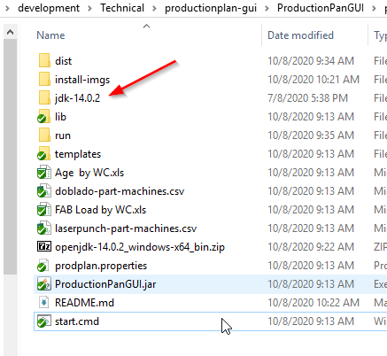
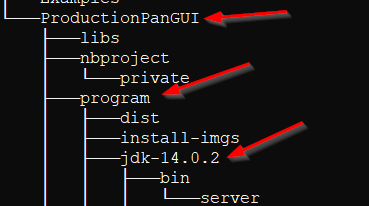
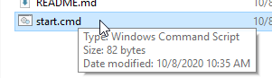
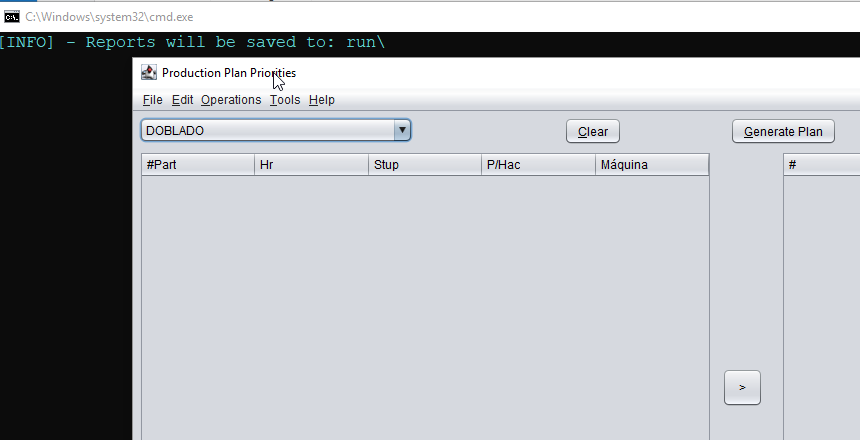

## Cómo correr el programa

1) Descargar este repositorio y descomprime el archivo .ZIP

2) ### Descargar JDK 14:
https://download.java.net/java/GA/jdk14.0.2/205943a0976c4ed48cb16f1043c5c647/12/GPL/openjdk-14.0.2_windows-x64_bin.zip

3) Descargar JDK 14:

4) Descomprimir archivo ZIP descargado del paso 3, cuando lo descargues, un directorio llamado "jdk-14.0.2" debería ser creado:

*Es importante colocar el directorio jdk-14.0.2* dentro del directorio "program"

Una vez que tienes esta estructura de directorios puedes borrar el archivo "openjdk-14.0.2_windows-x64_bin.zip".

5) Ejecutar el script "start.cmd":

